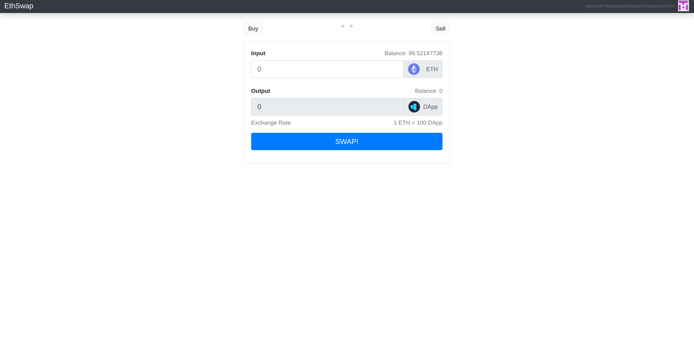

# This is my first crypto exchange

This want to be the first crypto exchange that I crate by watching the Dapp University tutorial

[Link here](https://www.youtube.com/watch?v=wF0TJMPKPdQ)

Frontend create with React

This is an axchange from eth to my token, using truffle, ganache, web3, solidity an react





## How to run
Clone the repository

Install dependencies
```
npm i
```

Check for error
```
truffle compile
```
Migrate
```
truffle migrate --reset
```
Run web
```
npm run start
```

You need to configure MetaMask before with your account, for test use ganache